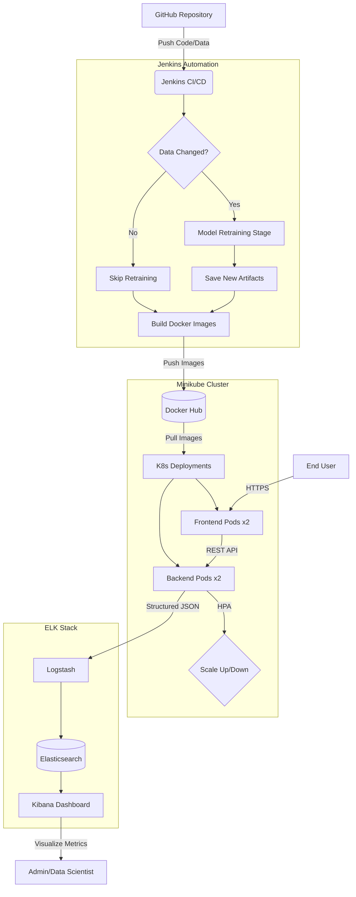

# 🏗️ CareerShield: MLOps Architecture

This document visualizes the end-to-end lifecycle of the CareerShield layoff risk prediction platform, from code commit to real-time monitoring.

## System Workflow

## Key Technical Features

| Feature | Implementation |
|---------|----------------|
| **CI/CD** | Jenkins with conditional retraining logic |
| **Orchestration** | Kubernetes (Minikube) with Rolling Updates |
| **Scalability** | Horizontal Pod Autoscaler (HPA) based on CPU |
| **Observability** | ELK Stack with structured JSON logging & `/metrics` endpoint |
| **Model Serving** | FastAPI with TensorFlow backend |
| **Deployment** | Zero-downtime rolling updates |
